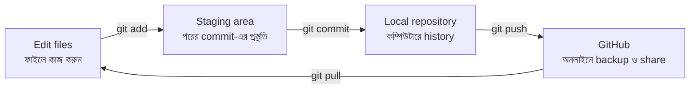

# Git Cheat Sheet: English + বাংলা

A simple Git reference for beginners. Git saves versions of your work on your computer. GitHub stores and shares those versions online.

**সহজ কথা:** Git আপনার কম্পিউটারে কাজের বিভিন্ন সংস্করণ সংরক্ষণ করে। GitHub সেই কাজ অনলাইনে রাখা ও শেয়ার করার জায়গা।

## The Big Picture | মূল ধারণা

Think of Git as three steps:

1. **Working folder:** files you are editing now.
2. **Staging area:** changes selected for the next snapshot.
3. **Repository:** saved commits in your local Git history.

**বাংলায়:**

1. **Working folder:** আপনি এখন যে ফাইল সম্পাদনা করছেন।
2. **Staging area:** পরের snapshot-এ রাখার জন্য বেছে নেওয়া পরিবর্তন।
3. **Repository:** আপনার কম্পিউটারে Git-এর সংরক্ষিত commit history।



## A Small Example | ছোট উদাহরণ

Suppose you edit `README.md` and want to save it online:

```bash
git status
git add README.md
git commit -m "docs: update README"
git push origin main
```

**What happens? / কী হয়?**

- `git status` shows what changed. / কী পরিবর্তন হয়েছে তা দেখায়।
- `git add README.md` selects the file for the next commit. / ফাইলটি পরের commit-এর জন্য বেছে নেয়।
- `git commit` saves a named checkpoint locally. / একটি নামসহ checkpoint কম্পিউটারে সংরক্ষণ করে।
- `git push` sends that commit to GitHub. / commit-টি GitHub-এ পাঠায়।

## 1. Check Your Work | কাজ দেখুন

```bash
git status
git diff
git diff --staged
```

- `git status`: কোন ফাইল বদলেছে, stage হয়েছে, বা নতুন আছে তা দেখুন।
- `git diff`: stage না করা পরিবর্তন দেখুন।
- `git diff --staged`: commit-এর জন্য stage করা পরিবর্তন দেখুন।

Run `git status` often, especially before `add`, `commit`, and `push`.

**বাংলায়:** `add`, `commit`, বা `push` করার আগে `git status` চালালে ভুল কম হয়।

## 2. Save a Change | পরিবর্তন সংরক্ষণ করুন

```bash
git add <file-name>
git add .
git commit -m "describe what changed"
```

- `git add <file-name>` stages one file.
- `git add .` stages all changes in the current folder. Review `git status` first.
- `git commit -m "..."` saves the staged changes as a checkpoint.

**বাংলায়:**

- `git add <file-name>` একটি নির্দিষ্ট ফাইল stage করে।
- `git add .` বর্তমান folder-এর সব পরিবর্তন stage করে। আগে `git status` দেখুন।
- `git commit -m "..."` stage করা পরিবর্তনকে একটি checkpoint হিসেবে সংরক্ষণ করে।

A good commit message says what changed, for example:

```bash
git commit -m "fix: correct SMTP port"
```

## 3. Branches | আলাদা কাজে আলাদা branch

A branch lets you work on a feature without changing `main` immediately.

**বাংলায়:** Branch ব্যবহার করলে `main`-কে সরাসরি না বদলে আলাদা জায়গায় feature বা bug fix করা যায়।

```bash
git branch
git switch -c feature/login
git switch main
git switch feature/login
git merge feature/login
```

- `git branch` lists branches. The `*` marks the current one.
- `git switch -c feature/login` creates and enters a new branch.
- `git switch main` moves to an existing branch.
- `git merge feature/login` combines that branch into the branch you are currently on.

Before merging, check that you are standing on the branch that should receive the changes:

```bash
git switch main
git merge feature/login
```

## 4. GitHub Remotes | GitHub-এর সঙ্গে সংযোগ

```bash
git remote -v
git remote add origin https://github.com/username/project.git
git push -u origin main
git push
git fetch
git pull
```

- `git remote -v`: shows where `origin` points.
- `git remote add origin ...`: connects a local repository to a GitHub repository.
- `git push -u origin main`: sends `main` for the first time and remembers its upstream.
- `git push`: sends later commits.
- `git fetch`: downloads remote history without changing your files.
- `git pull`: downloads remote changes and integrates them into your current branch.

**বাংলায়:** `fetch` শুধু remote-এর তথ্য আনে। `pull` সেই পরিবর্তন আপনার বর্তমান branch-এর সঙ্গে মিলিয়ে দেয়।

## 5. Read the History | পুরনো কাজ খুঁজুন

```bash
git log --oneline
git log --oneline --graph --all
git show <commit-hash>
git blame <file-name>
```

- `git log --oneline`: shows a short commit list.
- `git log --oneline --graph --all`: shows branches and history as a simple graph.
- `git show <commit-hash>`: shows one commit and its changes.
- `git blame <file-name>`: shows which commit and author last changed each line.

**বাংলায়:** কোনো লাইনের পরিবর্তন কে করেছিলেন জানতে `git blame` ব্যবহার করুন।

## 6. Pause and Recover | কাজ থামিয়ে আবার শুরু করুন

```bash
git stash push -m "WIP: unfinished feature"
git stash list
git stash pop
```

- `git stash` temporarily puts unfinished changes aside.
- `git stash list` shows saved stashes.
- `git stash pop` restores the newest stash.

For a new untracked file, include it explicitly:

```bash
git stash push --include-untracked -m "WIP: new file"
```

**বাংলায়:** নতুন untracked ফাইল stash করতে `--include-untracked` প্রয়োজন হতে পারে।

## 7. Fix Small Mistakes Carefully | ভুল ঠিক করুন

```bash
git restore <file-name>
git restore --staged <file-name>
git commit --amend -m "better message"
git reflog
```

- `git restore <file-name>` discards that file's unstaged edits.
- `git restore --staged <file-name>` removes a file from staging but keeps your edits.
- `git commit --amend` replaces the latest commit. Use it before pushing when possible.
- `git reflog` records where your local `HEAD` has been, which can help recover a lost commit.

**সতর্কতা / Warning:** `git restore <file-name>` এবং `git reset --hard` local changes মুছে দিতে পারে। নিশ্চিত না হলে আগে `git stash` নিন।

## A Safe Daily Routine | প্রতিদিনের নিরাপদ ধাপ

```bash
git status
git pull
git switch -c feature/my-change
# edit files
git diff
git add <file-name>
git diff --staged
git commit -m "describe the change"
git push -u origin feature/my-change
```

**বাংলায়:** আগে status দেখুন, কাজের জন্য branch তৈরি করুন, diff পরীক্ষা করুন, তারপর stage, commit, এবং push করুন।

## Quick Memory Aid | দ্রুত মনে রাখুন

```text
edit -> status -> add -> diff --staged -> commit -> push
কাজ  -> অবস্থা -> stage -> পরীক্ষা      -> সংরক্ষণ -> GitHub
```

When something feels unclear, run `git status`. It is usually the best next question to ask Git.

**বাংলায়:** কিছু বুঝতে না পারলে `git status` চালান। Git-কে জিজ্ঞেস করার জন্য এটিই সাধারণত সবচেয়ে ভালো প্রথম কমান্ড।
